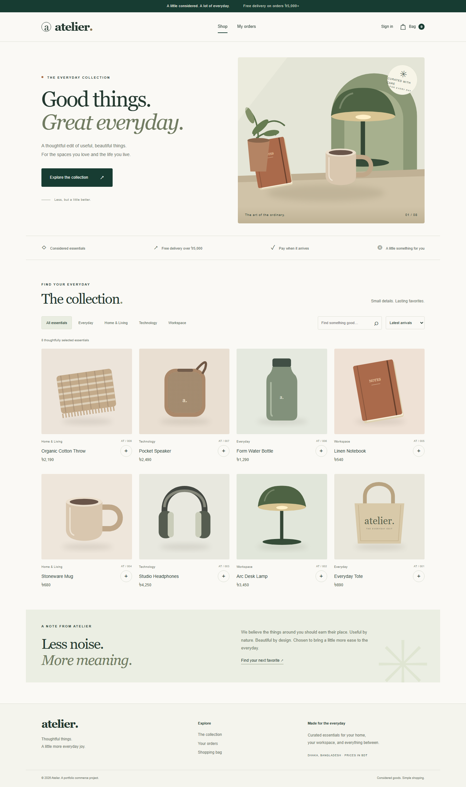

# Atelier — full-stack commerce

A complete local cash-on-delivery shopping application built with **Angular 22, Spring Boot 4, Java 21, and MySQL 8**. It includes a responsive storefront, customer accounts, an admin workspace, inventory protection, order tracking, and automated tests. No Lombok.



## Run on this Windows computer

MySQL is already configured in the ignored `config/application-local.properties` file. The application uses the dedicated `atelier_store` database, not the earlier project's database.

Open two terminals from the repository root:

```powershell
# Terminal 1
.\scripts\start-api.ps1

# Terminal 2
.\scripts\start-frontend.ps1
```

Open **http://127.0.0.1:4200**. API: http://localhost:8081. Health: http://localhost:8081/actuator/health.

The frontend helper uses the bundled Node 24 when this machine's default Node 20 is too old. Do not run a second copy if these ports are already occupied by the development servers.

Local demo accounts (created only when `app.seed-demo=true`):

| Role | Email | Password |
|---|---|---|
| Customer | customer@atelier.local | CustomerDemo123! |
| Admin | admin@atelier.local | AdminDemo123! |

These are disposable demonstration accounts, not production credentials. You can also register a new customer through the UI.

## Setup on another machine

Requirements: JDK 21+, Node 24.15+ (or Angular's supported Node 22.22.3+), MySQL 8.0, Maven or the included wrapper.

1. Create an empty MySQL database named `atelier_store` with utf8mb4 encoding. Use a dedicated database account.
2. Copy `config/application-local.properties.example` to `config/application-local.properties`. Set that account's credentials and a random signing secret of at least 32 bytes. The real file is ignored by Git.
3. From `frontend`, run `npm ci`.
4. From the root, run `mvn spring-boot:run`. In another terminal, run `npm start` from `frontend`.

Flyway owns the schema; Hibernate validates it. Do not point this project at an existing populated database and enable automatic Flyway baselining. Migrate old data deliberately if needed.

An optional self-contained demo exists: `mvn spring-boot:run -Dspring-boot.run.profiles=demo`. It uses an H2 file database under ignored `data/`. MySQL remains the default local and production database.

## Features

- **Storefront:** original SVG product artwork, responsive layout, category filtering, search, sorting, pagination, product detail pages, stock feedback, loading and empty states.
- **Accounts:** registration, BCrypt passwords, JWT access tokens, hashed rotating refresh tokens, session revocation on logout, and server-side USER/ADMIN authorization.
- **Cart:** private per-user cart, quantity validation, server-calculated BDT totals, shipping rules, and persistence across sign-ins.
- **Checkout:** reviewed-total validation, atomic conditional stock reservation, consistent product lock ordering, database transactions, and per-user idempotency keys.
- **Orders:** price and delivery snapshots, customer history, cancellation with one-time stock restoration, and restricted fulfillment transitions.
- **Admin:** product create/edit/deactivate, stock management, paginated orders, shipping/delivery actions, and real aggregate revenue/inventory metrics.
- **Delivery tooling:** versioned schema migration, 25 documented API operations, Docker/Compose definitions, GitHub Actions verification workflow, and Windows launch helpers.

Prices are in **BDT**. Delivery costs **৳120**, or is free for orders of **৳5,000+**. No extra tax is added in this portfolio implementation. Payment is cash on delivery; an admin's “Delivered & paid” action records collection. No card processing or online payment is implied.

## Verification

```powershell
# Root: fast isolated database tests + executable JAR
mvn package

# Root: run the same integration checks against real MySQL
mvn -Dtest.profile=mysqltest test

# Frontend: production build
npm run build

# Frontend: browser journeys. Playwright starts its own API and UI, so build
# the JAR first with `mvn package`, and use Node 24.15+ (the suite shells out
# to a bare `node`, which an older default Node on PATH will fail).
npx playwright install chromium
npm run test:e2e
```

For the MySQL suite on another machine, create `atelier_store_test`, set `TEST_DB_USERNAME`, `TEST_DB_PASSWORD`, and optionally `TEST_DB_URL`. The local machine uses ignored `config/application-mysqltest.properties` overrides. Never point automated tests at production. Tests create uniquely named fixtures; MySQL fixtures accumulate in the test schema.

Verified on 2026-09-17: **12 backend tests, green against both H2 and MySQL 8**, and **7 Playwright tests across desktop and mobile Chromium (14 runs)**. Browser tests exercise catalog search and responsive layout, registration, cart quantity changes, checkout, cancellation, logout, admin product creation and hiding, checkout recovery after a dropped response, safe checkout retry on the original idempotency key, admin edit conflicts, and access-token refresh while opening a protected page. Playwright starts its own API on port 8082 against a disposable in-memory database plus its own UI on port 4201, so the suite never reads or writes the development MySQL data.

The concurrency test initially passed on H2 but failed on MySQL. The fix uses conditional SQL stock updates and READ_COMMITTED checkout isolation; the MySQL regression now verifies that only one buyer can purchase the last unit. See [engineering notes](docs/architecture.md).

## API and project map

Import [docs/openapi.json](docs/openapi.json) into Postman or an OpenAPI viewer. See [API examples](docs/API.md).

```text
src/main/java/com/example/demo/
  config/       JWT, security, demo seed, session cleanup
  controller/   HTTP endpoints and error handling
  dto/          validated requests and immutable response records
  model/        JPA entities with explicit Java accessors
  repository/   database queries and inventory updates
  service/      account, catalog, cart, checkout, order rules
src/main/resources/db/migration/   Flyway SQL
src/test/                         backend integration tests
frontend/src/app/                 standalone Angular pages and API/session services
frontend/e2e/                     browser journeys
frontend/public/assets/           original product illustrations
scripts/                          local launch helpers
summery.md                        durable AI handoff and verification history
```

## Containers and CI

Copy `.env.example` to `.env`, replace the placeholder secrets, and run `docker compose up --build`. The frontend is bound to **127.0.0.1:8080**. Compose uses its own MySQL volume; it does not connect to or replace the device's MySQL service. Set `APP_SEED_DEMO=true` only for local demonstrations. With demo seeding disabled, create the first account through registration and promote a trusted account through an operator-managed database change.

The Nginx configuration provides SPA routing, an API reverse proxy, security headers, and basic per-IP authentication rate limiting. TLS, trusted proxy configuration, and public exposure require environment-specific setup. The standalone development API has no rate limiter.

Docker definitions and CI are included but have **not** been executed here: Docker was not available on this machine's PATH and no remote workflow was dispatched. The underlying Java, MySQL, Angular, and browser checks were executed locally.

## Portfolio and next steps

[CV evidence and demo guide](docs/CV_EVIDENCE.md) contains accurate resume bullets and interview prompts. The purchase workflow is implemented; it is not a claim of production traffic or a public deployment.

Before a public commercial launch: integrate a payment provider if needed, implement email verification and password reset, configure tax/shipping for the market, add delivery notifications, deploy behind HTTPS and rate limiting, configure backups/monitoring, and run accessibility, dependency, and load audits. Browser tokens currently use sessionStorage, which is accessible to JavaScript; a hardened deployment should evaluate an HttpOnly-cookie/BFF design with CSRF protection.
