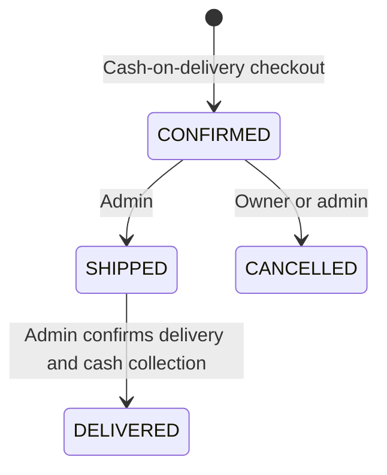
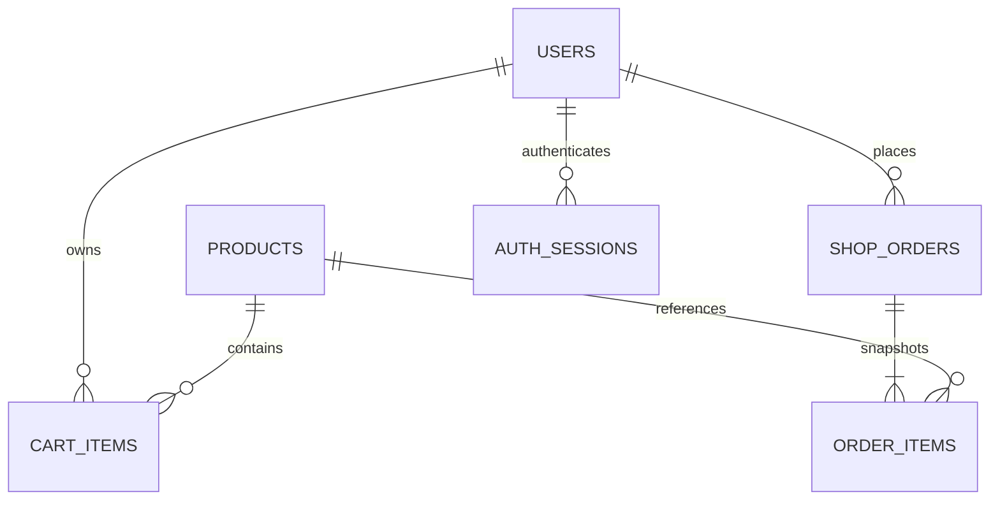

# Engineering decisions

## Request path
Angular standalone page -> typed Api service -> bearer interceptor -> Spring Security resource server -> controller validation -> transactional service -> JPA/MySQL -> immutable response DTO.

The browser keeps session state in a signal and sessionStorage. The interceptor deduplicates simultaneous refresh attempts so refresh-token rotation does not race across requests within one tab. Logout deletes the database session; signed access tokens are rejected after that deletion.

## Inventory and checkout

1. Validate the idempotency header and lock the authenticated user's row. This serializes that user's checkout/cart mutations.
2. Return an existing order for the same key and delivery/expected-total fingerprint. Reject reuse with changed details.
3. Load cart rows without fetching product state, then lock products in increasing ID order and refresh managed product state. Fetching products before locking would allow stale versions into the persistence context during concurrent purchases.
4. Reserve each quantity with `UPDATE products SET stock = stock - :quantity WHERE id = :id AND active = true AND stock >= :quantity`. Exactly one affected row is required.
5. Snapshot product names, images, prices, recipient, phone, address, and city into the order.
6. Recalculate shipping and total. Reject a mismatch with the customer-reviewed expectedTotal.
7. Persist the order and clear the cart in the same transaction. Any failure rolls back inventory changes and partial orders.

The implementation uses READ_COMMITTED isolation for checkout. A MySQL regression exposed that relying on a previously loaded JPA entity plus pessimistic locking under the default repeatable-read path was insufficient: both simultaneous buyers could succeed. The conditional SQL update is now the authoritative stock guard. This is why H2 checks alone were not accepted as inventory evidence.

Per-user idempotency intentionally returns the first order even after the cart has been cleared. A client must generate a new key for a new checkout. The Angular app persists the pending key and delivery details to survive transient request failures. Reloading checkout first performs an ownership-scoped, read-only lookup by key and displays any committed order. Retries without reloading keep the original key. The client fingerprint includes the reviewed total so a rejected price change can be reviewed and submitted as a new attempt.

Products carry a JPA version, added by the V2 migration. Native inventory reservation and restoration increment that version atomically. Admin updates lock the product and compare the submitted version before writing; stale forms receive 409 without changing stock or product details. The admin editor refreshes its list after a conflict so reopening the product loads current data.

## Order state machine

Cancellation locks the order and restores quantities via atomic increments. Repeated cancellation returns the existing cancelled order, so stock is restored once. Customer ownership violations return 404. Product deactivation retains historical order references.

## Data relationships

`cart_items` has a unique (user_id, product_id) constraint. `shop_orders` has a unique (user_id, idempotency_key) constraint. Email and hashed refresh tokens are unique. Money is DECIMAL(12,2)/BigDecimal, not floating point. Categories are normalized display strings on products in this version, not a separate category entity.

## Scope and tradeoffs

- One deployable Spring Boot service keeps transactions simple and is appropriate for this project's scale.
- Every bearer request checks the session database for immediate revocation. A larger deployment would need measured caching/revocation tradeoffs.
- Refresh-token rotation rejects reused old refresh tokens; token-family replay revocation across devices is not implemented.
- Admin inventory edits are absolute quantities protected by product versions. Reopening after a conflict requires the operator to review current inventory before editing again.
- Idempotency fingerprints cover delivery details and expected total, not a separately issued immutable cart quote.
- Checkout and order tests are transaction/concurrency checks, not throughput benchmarks.
- Tax is not modeled. Shipping is a fixed local rule. Only BDT and cash on delivery are supported.
- Static OpenAPI is maintained alongside controllers. CI schema drift checks would be a future improvement.
